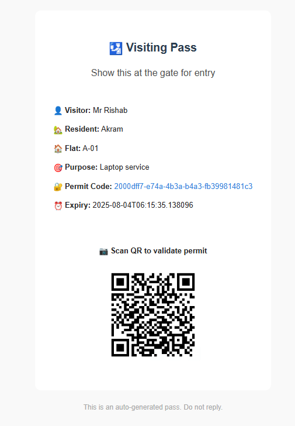

<div align="center">
  <h1>
     
    SocietyX - Society Management System API
  </h1>
  
  [](https://opensource.org/licenses/MIT)
  [](https://www.oracle.com/java/technologies/javase/jdk17-archive-downloads.html)
  [](https://spring.io/projects/spring-boot)
  []()
  
  A robust and secure Spring Boot-based backend API for modern residential society management.
</div>

## 🚀 Quick Start

```bash
# Clone the repository
git clone https://github.com/yourusername/societyxapi.git

# Navigate to project directory
cd societyxapi

# Build the project
mvn clean install

# Run the application
mvn spring-boot:run
```

## ✨ Key Features

| Feature | Description |
|---------|-------------|
| 🔐 **Secure Authentication** | JWT-based auth with role-based access control |
| 👥 **Visitor Management** | Digital visitor passes with QR code validation |
| 📱 **Real-time Notifications** | Email alerts for visits, approvals, and security |
| 🏡 **Resident Portal** | Manage visits, view history, and get notifications |
| 🛡️ **Security Dashboard** | Monitor and manage visitor access in real-time |
| 📊 **Admin Console** | Comprehensive management for society administrators |

## 🏗️ Project Structure

```
societyxapi/
├── src/
│   ├── main/
│   │   ├── java/com/lordscave/societyxapi/
│   │   │   ├── auth_module/       # Authentication & User Management
|   │   │   ├── admin_module/      # Admin Management
│   │   │   ├── security_module/   # Security configurations
│   │   │   ├── resident_module/   # Resident features
│   │   │   └── core/              # Core entities and repositories
│   │   └── resources/             # Configuration files
│   └── test/                      # Test files
├── screenshots/                   # Application screenshots
└── README.md                      # This file
```

## ✨ Features

- **User Authentication & Authorization**
  - JWT-based authentication
  - Role-based access control (Admin, Resident, Security)
  - Email verification
  - Password reset functionality

- **Visitor Management**
  - Visitor registration and tracking
  - Visit approval workflow
  - Digital visiting passes with QR codes
  - Check-in/Check-out system

- **Resident Features**
  - Profile management
  - Visit request management
  - Real-time notifications

- **Security Features**
  - Secure password hashing
  - Role-based authorization
  - Input validation
  - CSRF protection

## 📱 Screenshots

### Email Verification


### Password Reset


### Visit Approval Request


### Approved Visit Notification


### Security Guard Notification


### Visiting Pass


### Visit Validation


## 🚀 Technologies Used

- **Backend**: 
  - Java 21
  - Spring Boot 3.x
  - Spring Security
  - Spring Data JPA
  - Hibernate

- **Database**:
  - MySQL/PostgreSQL

- **Email Service**:
  - JavaMailSender

- **Authentication**:
  - JWT (JSON Web Tokens)

- **Build Tool**:
  - Maven

## 🛠️ Installation

1. **Prerequisites**:
   - Java 17 or higher
   - Maven 3.6.3 or higher
   - MySQL 8.0 or PostgreSQL 13 or higher

2. **Clone the repository**:
   ```bash
   git clone https://github.com/yourusername/societyxapi.git
   cd societyxapi
   ```

3. **Configure the application**:
   - Copy `application.properties.example` to `application.properties`
   - Update database credentials and other configurations

4. **Build and Run**:
   ```bash
   mvn clean install
   mvn spring-boot:run
   ```

## 📚 API Documentation

### Interactive Documentation
- **Swagger UI**: [http://localhost:8080/swagger-ui.html](http://localhost:8080/swagger-ui.html)
- **OpenAPI JSON**: [http://localhost:8080/v3/api-docs](http://localhost:8080/v3/api-docs)

### Downloadable Resources
- [📄 Swagger API Documentation (PDF)](document/Swagger-to-pdf-societyx.pdf) - Complete API reference in PDF format

### API Endpoints Overview

| Method | Endpoint | Description |
|--------|----------|-------------|
| `POST` | `/api/v1/auth/register` | Register a new user |
| `POST` | `/api/v1/auth/login` | Authenticate user |
| `POST` | `/api/v1/visits` | Create a new visit request |
| `GET` | `/api/v1/visits` | Get all visits |
| `PUT` | `/api/v1/visits/{id}/approve` | Approve a visit request |
| `POST` | `/api/v1/visits/{id}/check-in` | Check-in a visitor |
| `POST` | `/api/v1/visits/{id}/check-out` | Check-out a visitor |

> 💡 **Tip**: Import the Postman collection for ready-to-use API requests with example payloads.

## 🔒 Security

- All endpoints are secured by default
- Role-based access control
- Password hashing using BCrypt
- JWT token expiration
- Secure HTTP headers

## 📧 Email Notifications

The system sends various email notifications:
- Account verification
- Password reset
- Visit approval requests
- Visit confirmations
- Digital visiting passes

## 🌟 Features in Detail

### 🔐 Authentication & Security
- JWT-based authentication with role-based access
- Email verification for new accounts
- Secure password reset flow
- CSRF protection and input validation

### 🏡 Resident Features
- Profile management
- Visit request submission
- Visit history tracking
- Real-time notifications

### 🛡️ Security Features
- Visitor approval workflow
- Digital visiting passes with QR codes
- Check-in/Check-out system
- Visitor blacklisting

## 🛠️ Environment Variables

Create a `.env` file in the root directory with the following variables:

```properties
# Database Configuration
DB_URL=jdbc:mysql://localhost:3306/societyx
DB_USERNAME=your_username
DB_PASSWORD=your_password

# JWT Configuration
JWT_SECRET=your_jwt_secret_key
JWT_EXPIRATION=86400000

# Email Configuration
SPRING_MAIL_USERNAME=your_email@example.com
SPRING_MAIL_PASSWORD=your_email_password
```

## 📈 Roadmap

- [x] User Authentication & Authorization
- [x] Visitor Management System
- [ ] Mobile App Integration
- [ ] Analytics Dashboard
- [ ] Document Scanner Integration

## 🤝 Contributing

We welcome contributions! Please follow these steps:

1. Fork the repository
2. Create a feature branch (`git checkout -b feature/amazing-feature`)
3. Commit your changes (`git commit -m 'Add some amazing feature'`)
4. Push to the branch (`git push origin feature/amazing-feature`)
5. Open a Pull Request

## 📜 License

This project is licensed under the MIT License - see the [LICENSE](LICENSE) file for details.

## ✉️ Contact

For any queries or support, please reach out to us:

- 📧 Email: [azadmuk011098@gmail.com](mailto:azadmuk011098@gmail.com)

## 🙏 Acknowledgments

- Built with ❤️ using Spring Boot
- Inspired by modern society management needs
